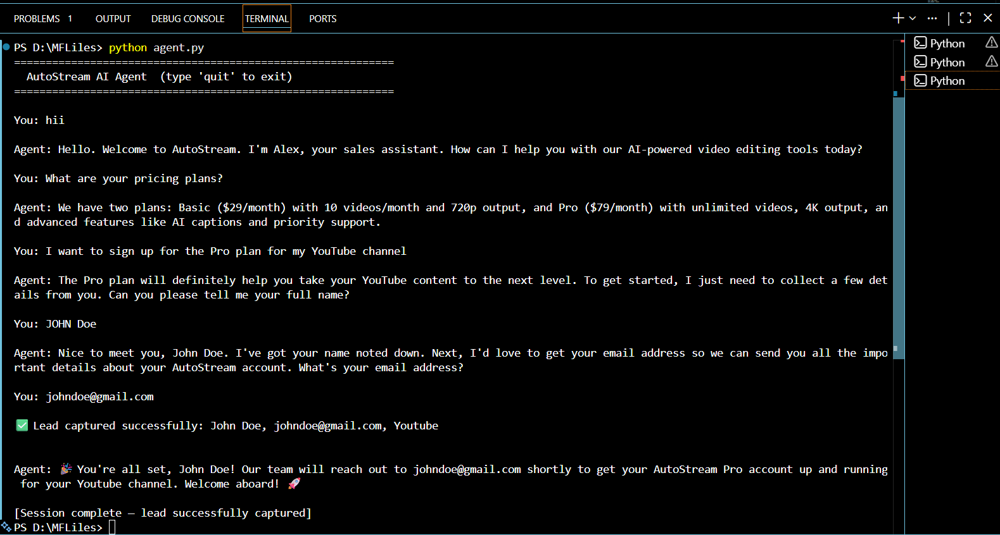

# AutoStream AI Agent

A conversational AI sales agent for **AutoStream** — a SaaS platform offering automated video editing for content creators. Built as part of the **ServiceHive / Inflx ML Intern Assignment**.

---

## Features

- 🧠 **Intent Classification** — Detects greeting, product inquiry, or high-intent signals
- 📚 **RAG Knowledge Retrieval** — Answers pricing/feature/policy questions from a local JSON knowledge base
- 🎯 **Lead Capture Tool** — Collects name, email, and creator platform only after confirmed high intent
- 🔄 **Multi-turn Memory** — Retains full conversation state across 5–6+ turns via LangGraph

---

## Project Structure

```
autostream-agent/
├── agent.py                      # Main agent (LangGraph graph + nodes)
├── requirements.txt              # Python dependencies
├── README.md                     # This file
└── knowledge_base/
    └── autostream_kb.json        # Local RAG knowledge base
```

---

## How to Run Locally

### 1. Clone / set up the project

```bash
git clone https://github.com/your-username/autostream-agent.git
cd autostream-agent
```

### 2. Create a virtual environment

```bash
python -m venv venv
source venv/bin/activate        # Windows: venv\Scripts\activate
```

### 3. Install dependencies

```bash
pip install -r requirements.txt
```

### 4. Set your API key

Create a `.env` file in the project folder:

> Get your key at: https://console.groq.com/

### 5. Run the agent

```bash
python agent.py
```

### Demo Session

---

## Architecture Explanation 

### Why LangGraph?

LangGraph was chosen over a simple chain or AutoGen because it provides **explicit, inspectable state management** through a typed `StateGraph`. Each conversation turn flows through well-defined nodes (intent classifier → router → responder or lead collector), making the agent's decision logic transparent and easy to extend. Unlike AutoGen's multi-agent conversation model — which is better suited for autonomous task delegation — LangGraph gives precise control over when tool calls happen, which is critical here: the lead capture tool must **never** fire prematurely.

### How State is Managed

A single `AgentState` TypedDict is passed through the graph on every turn. It holds:
- `messages` — the full conversation history (LangGraph's `add_messages` reducer appends safely)
- `intent` — the classified intent of the latest user message
- `collecting_lead` — flag indicating we're in lead-gathering mode
- `lead_data` — a dict accumulating `name`, `email`, `platform` as they're collected
- `lead_captured` — boolean set to `True` once `mock_lead_capture()` fires

This design ensures the agent remembers context across turns without relying on external memory stores. The RAG layer is stateless — it reads the local `autostream_kb.json` at startup and injects it into the system prompt, keeping retrieval fast and offline-capable.

---

## WhatsApp Deployment via Webhooks

### Overview

To deploy this agent on WhatsApp, we use the **WhatsApp Business Cloud API** (Meta) combined with a lightweight webhook server.

### Architecture

```
User (WhatsApp)
      │
      ▼
Meta WhatsApp Cloud API
      │  (HTTP POST — inbound message)
      ▼
Webhook Server  ◄──── ngrok / public HTTPS URL
  (FastAPI)
      │
      ├── Verify webhook token (GET /webhook)
      └── Handle message (POST /webhook)
              │
              ▼
        AutoStream Agent
        (LangGraph graph.invoke)
              │
              ▼
        Meta Send Message API  ──► User (WhatsApp)
```

### Step-by-Step Integration

#### 1. Set up a FastAPI webhook server

```python
# whatsapp_webhook.py
import os
import json
import httpx
from fastapi import FastAPI, Request, Response
from agent import build_graph, AgentState
from langchain_core.messages import HumanMessage, AIMessage

app = FastAPI()
compiled = build_graph()

# In-memory session store (use Redis in production)
sessions: dict[str, AgentState] = {}

VERIFY_TOKEN = os.environ["WA_VERIFY_TOKEN"]
WA_TOKEN = os.environ["WA_ACCESS_TOKEN"]
PHONE_ID = os.environ["WA_PHONE_NUMBER_ID"]

@app.get("/webhook")
async def verify(request: Request):
    """Meta webhook verification handshake."""
    params = dict(request.query_params)
    if params.get("hub.verify_token") == VERIFY_TOKEN:
        return Response(content=params["hub.challenge"])
    return Response(status_code=403)

@app.post("/webhook")
async def receive_message(request: Request):
    body = await request.json()
    try:
        entry = body["entry"][0]["changes"][0]["value"]
        msg = entry["messages"][0]
        from_number = msg["from"]
        user_text = msg["text"]["body"]
    except (KeyError, IndexError):
        return {"status": "ignored"}

    # Retrieve or initialise session state
    state = sessions.get(from_number, {
        "messages": [], "intent": "GREETING",
        "collecting_lead": False, "lead_data": {}, "lead_captured": False
    })

    state["messages"] = state["messages"] + [HumanMessage(content=user_text)]
    state = compiled.invoke(state)
    sessions[from_number] = state

    reply = next(
        (m.content for m in reversed(state["messages"]) if isinstance(m, AIMessage)),
        "I'm sorry, something went wrong."
    )

    # Send reply via WhatsApp Cloud API
    async with httpx.AsyncClient() as client:
        await client.post(
            f"https://graph.facebook.com/v19.0/{PHONE_ID}/messages",
            headers={"Authorization": f"Bearer {WA_TOKEN}"},
            json={
                "messaging_product": "whatsapp",
                "to": from_number,
                "type": "text",
                "text": {"body": reply}
            }
        )
    return {"status": "ok"}
```

#### 2. Expose locally with ngrok (for dev/testing)

```bash
pip install fastapi uvicorn httpx
uvicorn whatsapp_webhook:app --port 8000

# In another terminal:
ngrok http 8000
# Copy the HTTPS URL, e.g. https://abc123.ngrok.io
```

#### 3. Register the webhook on Meta Developer Console

1. Go to https://developers.facebook.com → your app → WhatsApp → Configuration
2. Set **Callback URL** to `https://abc123.ngrok.io/webhook`
3. Set **Verify Token** to match your `WA_VERIFY_TOKEN` env var
4. Subscribe to the `messages` webhook field

#### 4. Set environment variables

```bash
export WA_VERIFY_TOKEN=my_secret_token
export WA_ACCESS_TOKEN=EAAxxxxx...   # From Meta App Dashboard
export WA_PHONE_NUMBER_ID=1234567890
export ANTHROPIC_API_KEY=sk-ant-...
```

#### 5. Production considerations

| Concern | Recommendation |
|---|---|
| Session storage | Replace in-memory `sessions` dict with **Redis** |
| Scalability | Deploy on **Railway / Render / AWS Lambda** |
| Rate limits | WhatsApp Cloud API allows ~80 msgs/sec on verified numbers |
| Lead storage | Replace `mock_lead_capture` with a real CRM webhook (HubSpot, Salesforce) |
| Error handling | Add retry logic and dead-letter queue for failed API calls |

---

## Evaluation Checklist

| Criterion | Status |
|---|---|
| Intent detection (greeting / inquiry / high-intent) | ✅ |
| RAG from local knowledge base | ✅ |
| State retained across 5–6 turns | ✅ |
| Tool triggered only on high intent | ✅ |
| All three lead fields collected before tool fires | ✅ |
| Clean, structured code | ✅ |
| WhatsApp deployment explained | ✅ |

---

## Tech Stack

| Layer | Technology |
|---|---|
| Language | Python 3.9+ |
| Agent Framework | LangGraph (StateGraph) |
| LLM | Claude 3 Haiku (Anthropic) |
| RAG | Local JSON + system prompt injection |
| CLI Interface | Python `input()` loop |
| WhatsApp Integration | Meta WhatsApp Cloud API + FastAPI |
